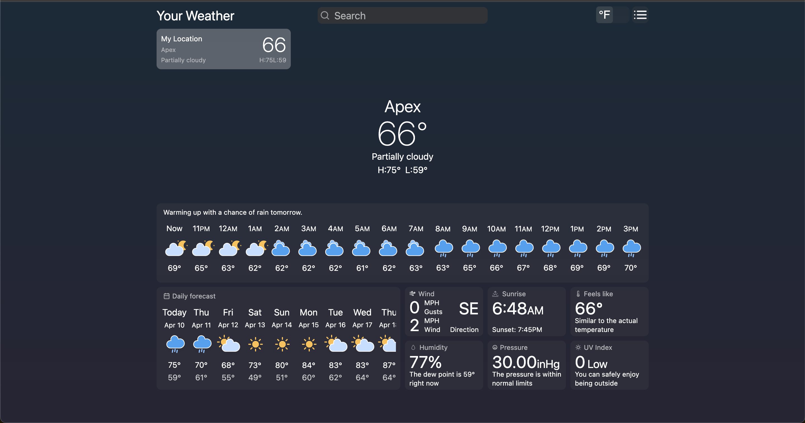
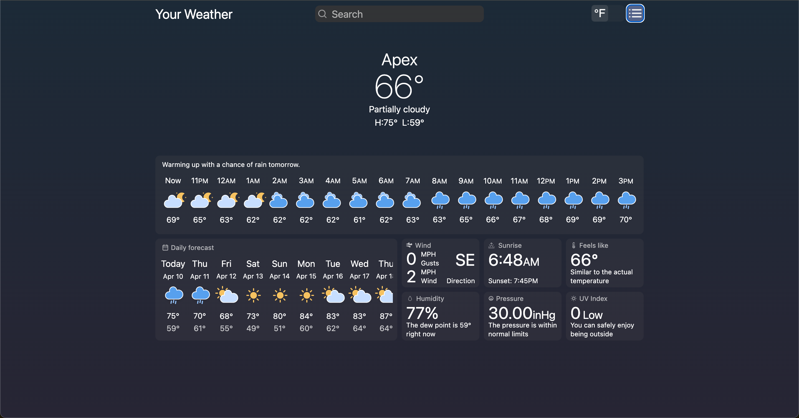
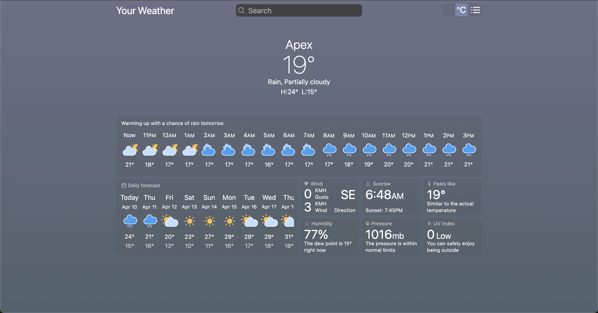
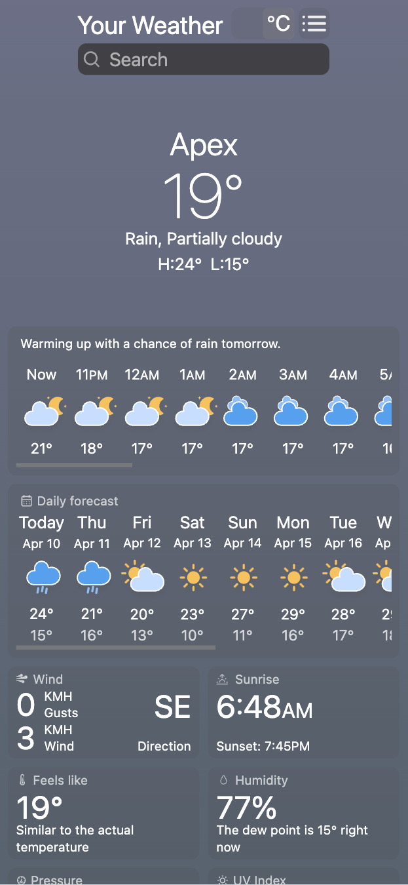
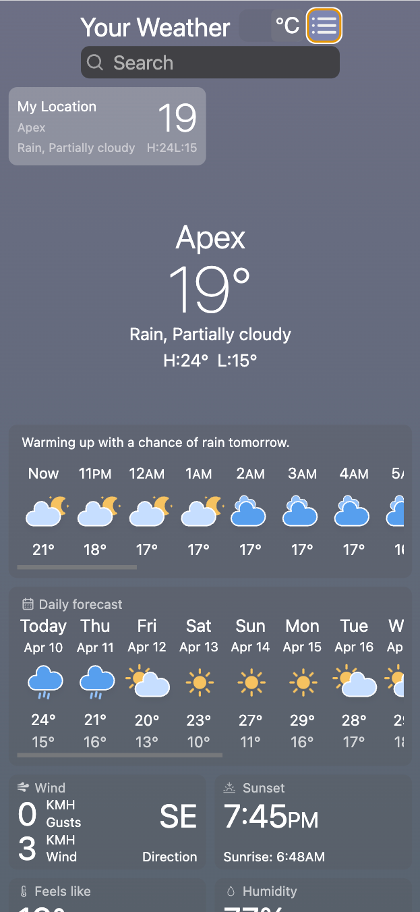

## Your Weather

The most simple weather application with option to add locations to Favorites, show/close favourites menu and change unit of measure. App shows daily forecast, hourly forecast, variety of weather conditions, gets your location and changes background depending on time and weather 

I'm not a designer, but I've done my best for the fully responsive design in this project.

+ Technology Stack: React(including React Hooks), Tailwind

Deployment: https://nikolaitsykin.github.io/react-weather-app/

The main page with search and weather forecast for 14 days

Favourites menu

Unit switch

Responsive desing for smaller screens

Responsive desing for smaller screens

