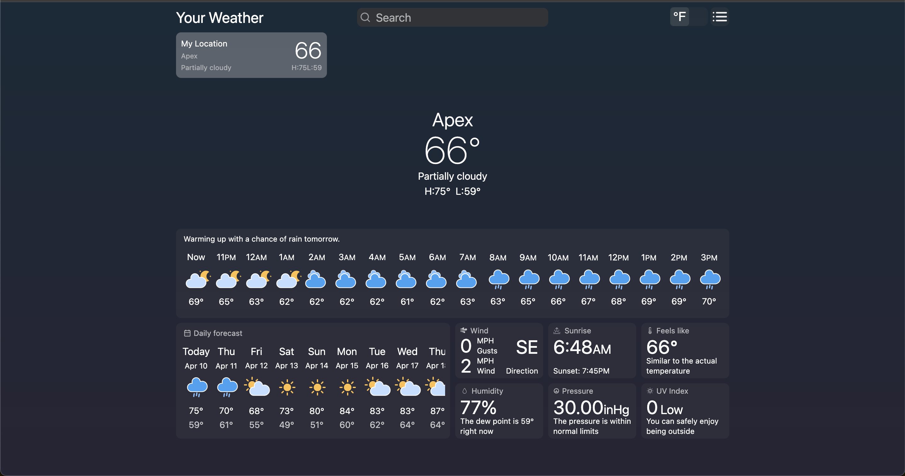
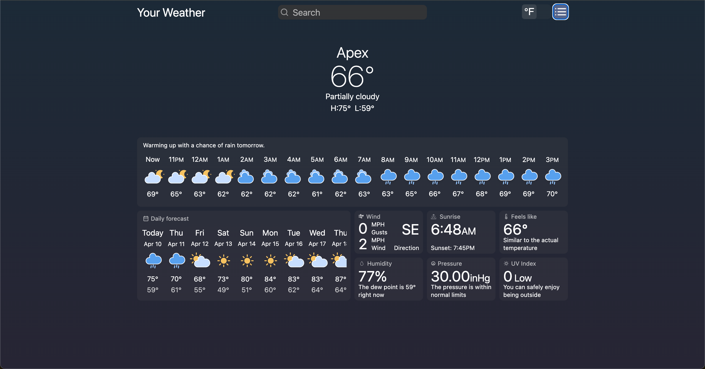
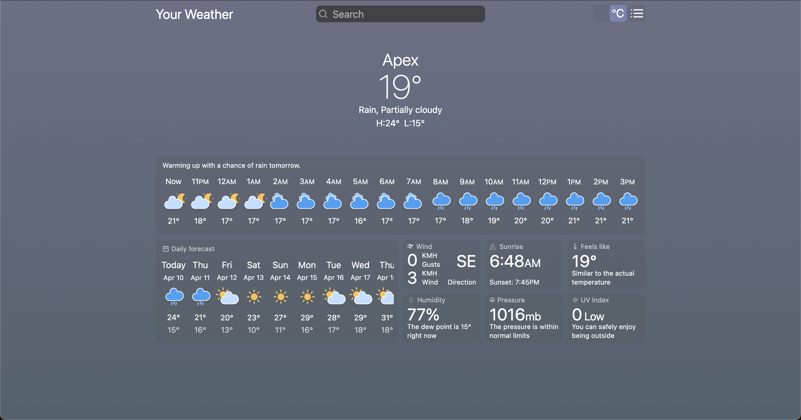
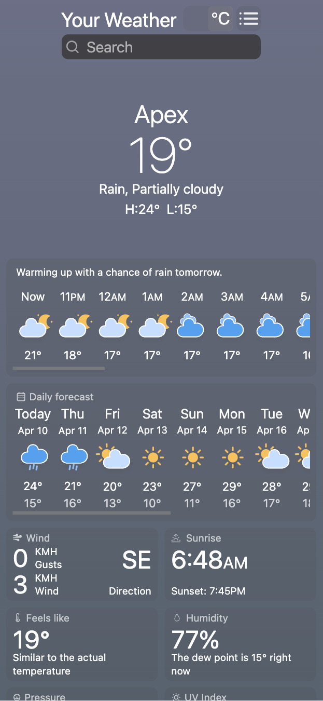
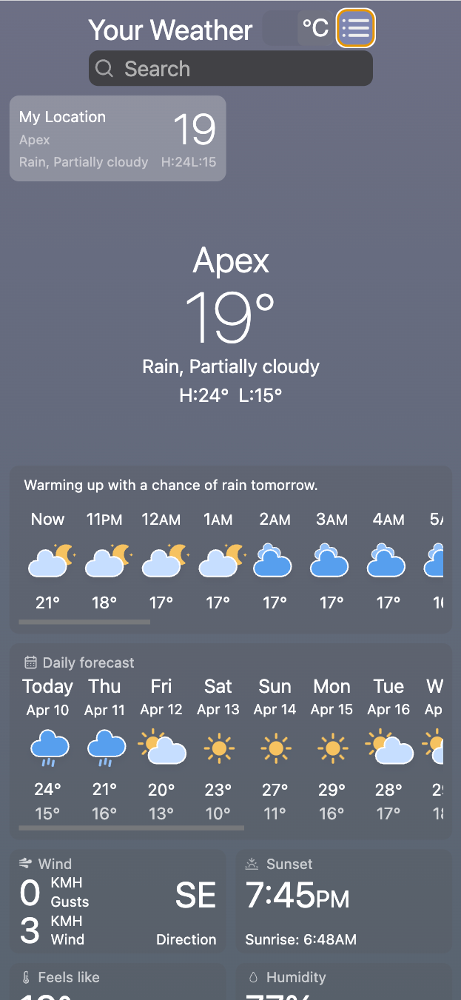

## Your Weather

Website Description: React Weather App

The React Weather App is a functional and user-friendly application designed to provide users with up-to-date weather information for any location. Developed with React, this single-page app showcases streamlined design and efficient data integration to offer a responsive and interactive experience.

Core Function: To deliver real-time weather information, including temperature, humidity, and weather conditions, by location.

Target Audience: Individuals seeking a simple, reliable way to access weather data for current or future plans, including travelers, outdoor enthusiasts, and everyday users.

Unique Selling Points: Real-time weather updates using a simple, responsive design; easy-to-navigate interface; designed with React for smooth and fast performance.

Key Features:

Location-Based Search: Allows users to enter any city or location to retrieve current weather data.
Real-Time Weather Data: Displays temperature, humidity, weather conditions, and icons that visually represent current conditions.
Responsive Design: Ensures smooth operation on desktop and mobile devices, adapting to various screen sizes.
Dynamic Data Integration: Integrates with a weather API to fetch live weather information, providing a responsive and up-to-date user experience.
Design Aesthetic: Clean and minimalistic, with a focus on readability and ease of use. Clear, modern typography and weather-themed icons make it visually appealing and practical.

User Experience: Intuitive and straightforward, with immediate weather results upon search. The app is designed to be fast-loading and easy to navigate, ensuring users can access information quickly and effortlessly.

This project demonstrates practical skills in React, API integration, and responsive design, creating a functional tool that meets the everyday needs of users seeking reliable weather information.
Technology Stack: React(including React Hooks), Tailwind

Deployment: https://nikolaitsykin.github.io/react-weather-app/

The main page with search and weather forecast for 14 days

Favourites menu

Unit switch

Responsive desing for smaller screens

Responsive desing for smaller screens

